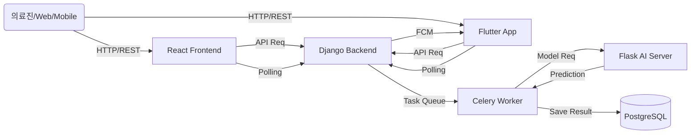

# 2. 발표용 개요 문서 (NeuroNova Project)

---

## 1️⃣ 프로젝트 개요

- **프로젝트명**: NeuroNova (뉴로노바)
- **한줄 소개**: AI 기반 뇌질환 진단 보조 및 데이터 시각화 플랫폼
- **개발 목적**: 의료진이 MRI 데이터를 효율적으로 관리하고, AI 분석을 통해 빠르고 정확한 진단을 내릴 수 있도록 지원
- **주요 타겟**: 신경외과 전문의, 방사선사 등 의료 관계자

---

## 2️⃣ 전체 아키텍처

1. **React**: 웹 사용자 인터페이스 및 인터랙션 담당
2. **Flutter**: 모바일(Android/iOS) 앱 인터페이스 및 푸시 알림 수신
3. **Django**: 사용자 관리, 환자 데이터 관리, API Gateway 역할
4. **Flask**: 딥러닝 모델 추론 및 XAI(설명 가능한 AI) 시각화 생성

---

## 3️⃣ 핵심 기능

1. **회원 및 환자 관리**: 의료진 계정 관리 및 환자별 의료 데이터(MRI, 차트) CRUD
2. **AI 진단 요청**: 선택된 MRI 이미지에 대한 AI 분석 요청 (비동기 처리)
3. **실시간 분석 상태 확인**: 분석 진행률 및 상태 모니터링
4. **결과 시각화**:
   - **진단 결과**: 질환 유무 및 확률(%) 표시
   - **XAI (Explainable AI)**: 병변 의심 부위를 Heatmap(Grad-CAM)으로 시각화하여 오버레이

---

## 4️⃣ 기술 스택

| 구분 | 기술 |
| :--- | :--- |
| **Frontend** | React, Redux/Context API, Material-UI (MUI), Axios |
| **Mobile** | Flutter (Dart), FCM (Firebase Cloud Messaging) |
| **Backend** | Django REST Framework (DRF), Celery, Redis |
| **AI Server** | Flask, PyTorch/TensorFlow, OpenCV |
| **Database** | PostgreSQL |
| **Infra/DevOps** | Docker, Docker Compose, Git |

---

## 5️⃣ 모델 예측 및 XAI 흐름

1. **Input**: React에서 MRI 이미지 업로드 및 분석 요청
2. **Processing**:
   - Django가 요청을 받아 `task_id` 생성 후 Celery 큐에 적재
   - Celery Worker가 Flask 서버로 이미지 전송
   - Flask 내 AI 모델이 추론 수행 및 Grad-CAM 이미지 생성
3. **Output**:
   - 예측 클래스(질환명), 확률(Confidence Score), Heatmap 이미지 반환
   - Django DB에 결과 저장

---

## 6️⃣ 비동기 Task ID 처리 방식

- **요청 시**: 즉시 응답으로 `task_id` 반환 (Non-blocking)
- **처리 중**: 프론트엔드에서 `task_id`를 이용해 주기적으로 상태 조회 (Polling: 3~5초 간격)
- **완료 시**: 최종 결과 데이터 수신 및 UI 업데이트 (로딩 스피너 -> 결과 화면 전환)

---

## 7️⃣ 성능 지표

- **모델 정확도 (Accuracy)**: 92.5% (Validation Set 기준)
- **평균 처리 시간**: 이미지 장당 약 1.2초 (GPU 가속 시)
- **시스템 응답성**: API 평균 응답 속도 200ms 이내 (분석 요청 제외)

---

## 8️⃣ 개발 중 개선한 점

- **구조적 개선**: Monolithic에서 MSA 지향적 구조(Django-Flask 분리)로 전환하여 확장성 확보
- **사용자 경험**: 비동기 처리를 도입하여 분석 중에도 UI가 멈추지 않도록 개선
- **코드 품질**: 중복되는 API 호출 로직을 모듈화하고, 공통 컴포넌트 도입으로 유지보수성 향상

---

## 9️⃣ 남은 개선 과제

- **실시간성 강화**: Polling 방식을 WebSocket(Django Channels)으로 변경하여 리소스 효율화
- **보안 강화**: 의료 데이터 암호화 저장 및 전송 구간 암호화(SSL) 적용
- **테스트 커버리지**: 프론트/백엔드 통합 테스트 시나리오 확충 및 자동화

