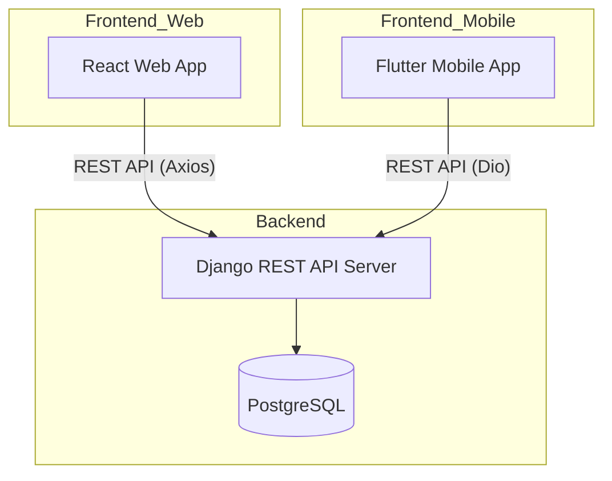
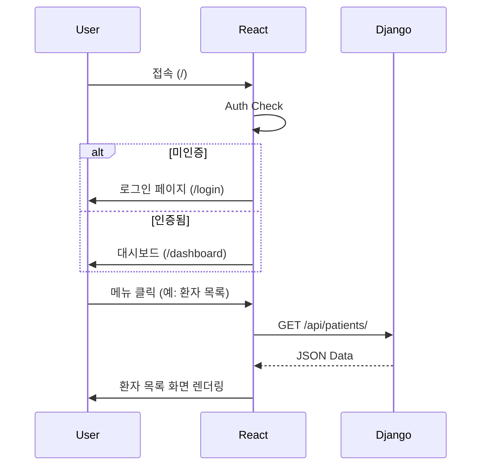
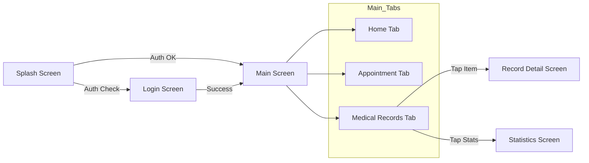

# 시스템 아키텍처 및 화면 전환 보고서

## 1. 시스템 개요 (System Overview)
NeuroNova 프로젝트는 **Django (Backend)**, **React (Web Frontend)**, **Flutter (Mobile App)**의 3계층 구조로 구성되어 있습니다. Django는 중앙 API 서버로서 데이터와 인증을 관리하며, React와 Flutter는 각각 웹과 모바일 환경에서 사용자 인터페이스를 제공합니다.

## 2. Django (Backend) 역할
- **API Provider**: RESTful API를 통해 프론트엔드(React, Flutter)에 데이터를 제공합니다.
- **Authentication**: JWT (JSON Web Token) 기반의 인증을 처리합니다.
- **Business Logic**: 환자 관리, 예약, AI 진단 결과 처리 등의 핵심 로직을 수행합니다.

## 3. React (Web Frontend) 연결 및 화면 전환

### 3.1 연결 방식
- **Library**: `axios`를 사용하여 Django API와 통신합니다.
- **Auth**: JWT 토큰을 로컬 스토리지에 저장하여 인증 상태를 유지합니다.

### 3.2 화면 전환 (Screen Transitions)
React는 **SPA (Single Page Application)** 구조이며, `react-router-dom` 라이브러리를 사용하여 화면을 전환합니다.

#### 주요 라우팅 흐름
1.  **인증 (Authentication)**
    - `/login`: 로그인 페이지
    - `/register`: 회원가입 페이지
    - 로그인 성공 시 `DashboardRedirect` 컴포넌트가 사용자 역할(Role)에 따라 적절한 대시보드로 리다이렉트합니다.

2.  **대시보드 (Dashboard)**
    - `/admin/dashboard`: 관리자용
    - `/doctor/dashboard`: 의사용
    - `/staff/dashboard`: 간호사/직원용
    - `/patient/dashboard`: 환자용 (웹 접근 시)

3.  **기능별 라우트 (Feature Routes)**
    - `/patients`: 환자 목록 조회
    - `/patients/:id`: 환자 상세 정보
    - `/dicom/:studyId`: 의료 영상(DICOM) 뷰어
    - `/diagnosis/:id`: AI 진단 결과 상세

## 4. Flutter (Mobile App) 연결 및 화면 전환

### 4.1 연결 방식
- **Library**: `dio` 패키지를 사용하여 Django API와 통신합니다.
- **Auth**: `flutter_secure_storage`에 JWT 토큰을 안전하게 저장합니다.

### 4.2 화면 전환 (Screen Transitions)
Flutter는 `MaterialApp`의 `routes` 맵을 사용하여 네비게이션을 관리합니다.

#### 주요 라우팅 흐름
1.  **초기화 (Initialization)**
    - 앱 실행 시 `SplashScreen`에서 자동 로그인 여부를 확인합니다.
    - 로그인 되어 있으면 `/main`, 아니면 `/login`으로 이동합니다.

2.  **메인 네비게이션 (Main Navigation)**
    - `/main`: 하단 탭바(BottomNavigationBar)를 포함한 메인 화면.
    - 탭 구성: 홈, 예약, 진료내역, 알림, 프로필.

3.  **상세 화면 (Detail Screens)**
    - `/medical-records`: 진료 내역 목록
    - `/record-detail`: 진료 내역 상세 (Arguments로 ID 전달)
    - `/report-statistics`: 건강 상태 통계 (신규 추가)

## 5. 결론
NeuroNova 시스템은 Django를 중심으로 React와 Flutter가 유기적으로 연결되어 있습니다.
- **React**는 의료진을 위한 복잡한 데이터 관리와 시각화(DICOM 등)에 최적화된 라우팅 구조를 가집니다.
- **Flutter**는 환자의 접근성과 편의성을 최우선으로 하여, 직관적인 탭 기반 네비게이션과 빠른 화면 전환을 제공합니다.
두 플랫폼 모두 JWT 기반의 동일한 인증 체계를 사용하여 보안성을 유지하면서도 각 환경에 맞는 최적의 사용자 경험을 제공합니다.
